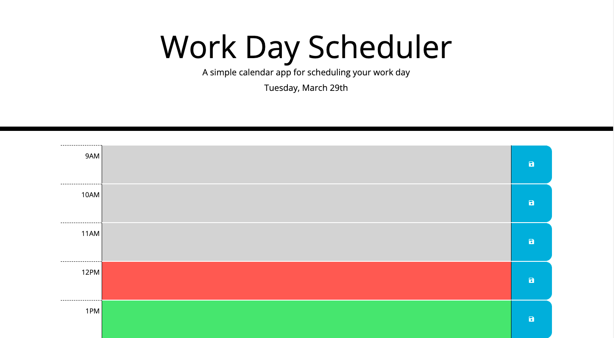

# Work Day Calendar by YI

# Purpose
This is a work day calendar to manage daily plans effectively. Easy to set and save events! Saved events will not be lost even after closing the app. It'll still be there for you😉

## Description
* The current day will be displayed at the top of the calendar.
* Below the current day, standard business hours time blocks are displayed to enter events and check your plan.
* Each time block is colored to indicate whether it is in the past, present, or future. The app will check the current time every 30 minutes. 
    
* Enter events by clicking the space next to the time. 
    
* Save the events to local storage by clicking the button next to the events you want to save. 
    
* The save events will persist after refreshing the page. 
    

## Built With
* HTML
* CSS
* Bootstrap
* REMIX ICON
* JavaScript
* jQuery

## Website
https://yurii92.github.io/yi-work-day-scheduler/

## Contribution
Made with ❤️ by Yuri Ichikawa